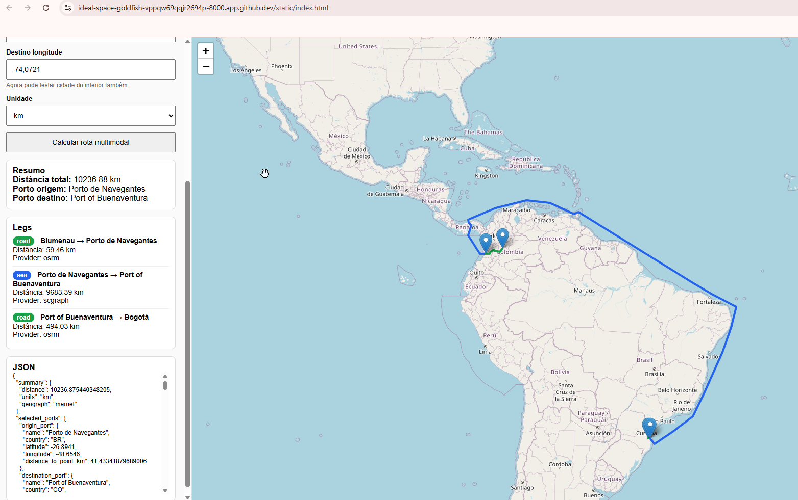
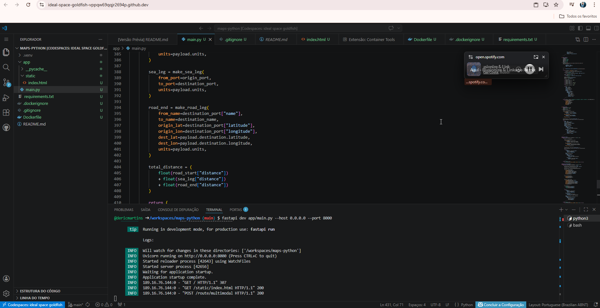

# Multimodal Route Estimator

## Screenshots

### Visualização da rota multimodal


### Execução no GitHub Codespaces


Aplicação simples para **estimar rotas multimodais de entrega internacional**, combinando:

- **trecho rodoviário de origem até o porto**
- **trecho marítimo entre portos**
- **trecho rodoviário do porto até o destino final**

Tudo isso rodando de forma simples em **Python + FastAPI**, com visualização direto no **navegador**, e podendo ser testado facilmente no **GitHub Codespaces**.

---

## Objetivo

Este projeto foi criado para validar a ideia de um sistema capaz de **simular rotas de transporte de mercadorias entre cidades e países**, mesmo quando a origem ou o destino estão **no interior**, longe da costa.

A proposta é montar uma rota completa com três etapas:

1. **rodoviário inicial**: cidade de origem até o porto mais adequado  
2. **marítimo**: porto de saída até porto de chegada  
3. **rodoviário final**: porto de chegada até a cidade de destino  

O foco do projeto é a **rota** e a **visualização no mapa**, sem entrar ainda em preço, prazo comercial, frete ou cotação.

---

## Problema que a aplicação resolve

Quando uma mercadoria precisa sair de uma cidade no interior e ser entregue em outro país, a rota normalmente não é apenas um trajeto direto.

Na prática, o fluxo costuma ser:

**cidade → porto → rota marítima → porto → cidade**

Esse tipo de lógica não é bem representado por ferramentas de mapa comuns, porque elas normalmente mostram só:

- rota rodoviária
- ou rota entre dois pontos simples
- ou rota marítima isolada

Este projeto resolve esse problema ao unir diferentes modais em uma única visualização, permitindo:

- testar rotas saindo de cidades do interior
- visualizar o caminho completo da entrega
- identificar o porto de saída e o porto de chegada
- entender a decomposição da rota por etapa
- validar rapidamente cenários de logística internacional

---

## Exemplo de uso

Exemplo de cenário:

- **Origem:** Blumenau, SC, Brasil
- **Destino:** Bogotá, Colômbia

A aplicação calcula algo como:

- Blumenau → Porto de Navegantes (**rodoviário**)
- Porto de Navegantes → Port of Buenaventura (**marítimo**)
- Port of Buenaventura → Bogotá (**rodoviário**)

No mapa, cada etapa aparece com uma cor diferente:

- **verde** para rodoviário
- **azul** para marítimo

---

## Funcionalidades atuais

- interface web simples no navegador
- execução local ou no GitHub Codespaces
- cálculo de rota multimodal
- escolha automática do porto de origem e destino
- visualização da rota no mapa com Leaflet
- exibição das etapas da rota
- exibição da distância total estimada
- API HTTP com FastAPI
- serviço marítimo usando **SCGraph**
- serviço rodoviário usando **OSRM**
- fallback rodoviário por linha reta quando o OSRM falha

---

## Tecnologias utilizadas

### Backend
- Python
- FastAPI
- SCGraph
- OSRM (via endpoint HTTP)
- Pydantic

### Frontend
- HTML
- CSS
- JavaScript
- Leaflet
- OpenStreetMap

### Ambiente de execução
- GitHub Codespaces
- Navegador web

---

## Como funciona

A aplicação recebe:

- nome da origem
- latitude e longitude da origem
- nome do destino
- latitude e longitude do destino

Depois executa este fluxo:

1. encontra o **porto mais próximo** da origem
2. encontra o **porto mais próximo** do destino
3. calcula a rota rodoviária da origem até o porto
4. calcula a rota marítima entre os portos
5. calcula a rota rodoviária do porto até o destino
6. soma as distâncias
7. desenha tudo no mapa

---

## Estrutura do projeto

```text
app/
  main.py
  static/
    index.html

requirements.txt
Dockerfile
README.md